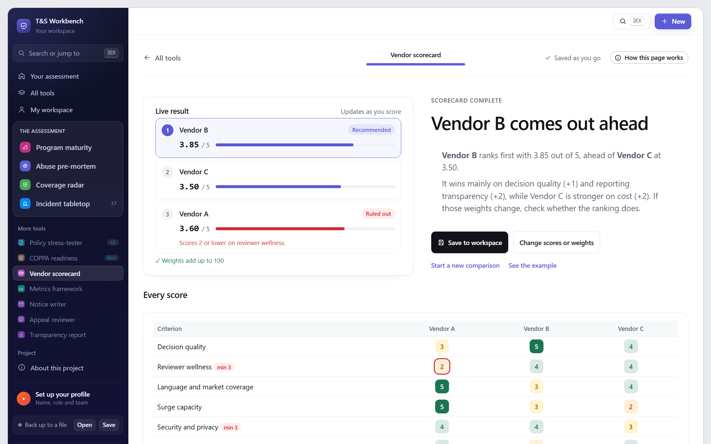
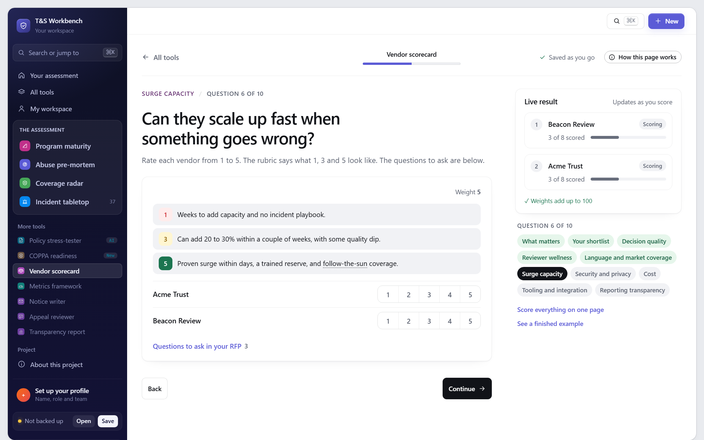
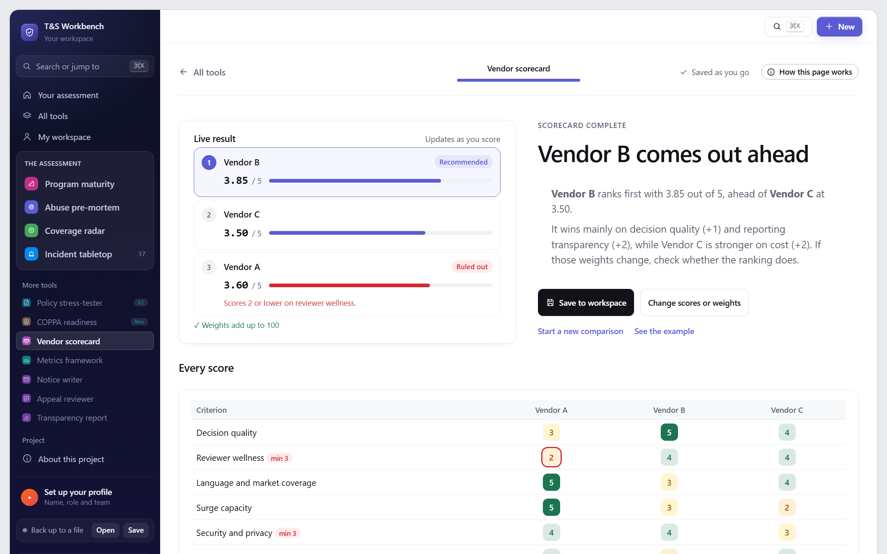

# Moderation Vendor Scorecard

> **Which moderation vendor should you trust with your users and your reviewers?**

Compare any two to four moderation vendors: specialists, outsourcing firms, regional teams or tools. Weight what matters (or start from a preset such as regulated or cost-first), score your shortlist against a clear 1-to-5 rubric on 8 criteria, and see who wins and why. Reviewer wellness and security are minimums: a vendor that fails them is out, however cheap.

**[Try it live](https://stevenmacchia.com/ts-workbench/#vendors)** · part of [T&S Workbench](https://github.com/stevenmacchia/ts-workbench) · free, no sign-up

## The problem

Moderation vendors are often chosen on price and a polished demo. Reviewer wellness, language coverage and real quality evidence come up after the contract is signed, when switching is expensive.

## How it works

1. **Set what matters.** Start from a preset (balanced, quality first, cost, regulated, many languages) or weight eight criteria to add up to 100.
2. **Score your shortlist.** One criterion per screen: rate each vendor 1 to 5 against a rubric, with the RFP questions to ask and the ranking filling in beside you. Or score everything on one page.
3. **Read the result.** A live ranking, why the winner won, and a heat map of strengths and gaps.

## What's in this repo

The tool's knowledge, published as open content you can read, reuse and adapt.

| File | What it is |
|---|---|
| [`rubric.md`](rubric.md) | 8 criteria, each with its question, what a 1, 3 and 5 look like, and RFP questions |
| [`rfp-questions.md`](rfp-questions.md) | A copy-paste question bank for your RFP |
| [`data/criteria.json`](data/criteria.json) | The rubric as JSON |

## Use it for

- Running an RFP for content moderation
- Contract renewals
- Quarterly business reviews with an existing vendor

## More screenshots

## License and credit

Content in this repo is licensed [CC BY 4.0](LICENSE): reuse and adapt it freely, with credit. The tool's source code is in [ts-workbench](https://github.com/stevenmacchia/ts-workbench) under the MIT license.

Built by [Steven Macchia](https://www.linkedin.com/in/stevenmacchia), Trust & Safety leader, with AI-assisted development (Claude).
